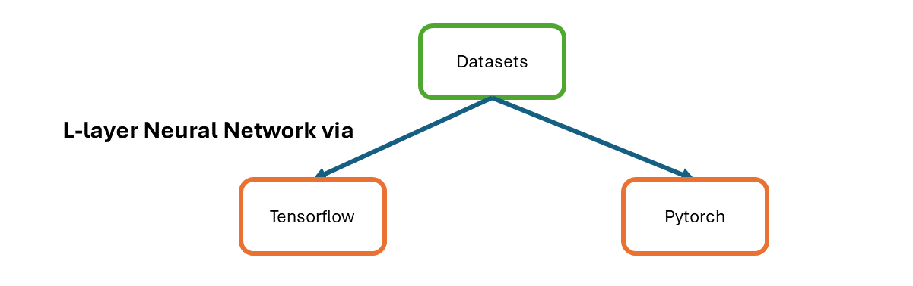
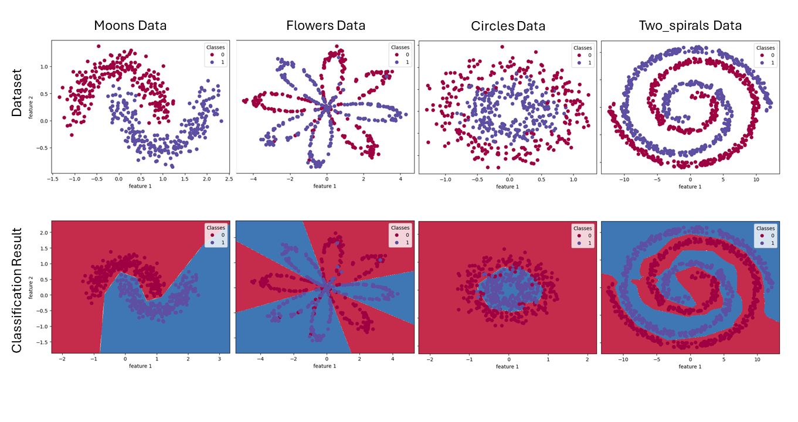

# p006-neural-network-layers-comparison
Using synthetic data for binary classification, explore neural networks layers effect and limitation. Implemented in tensorflow and pytorch. 

 
 
Testing folder contains plain python neural network to verify some results.
 
Datasets used are moons, flowers, circles and two_spirals. Folders are named after these and contain 2 tensorflow and 2 pytorch implementation ipynb files. 2 files of framework achieve same results but different style of APIs. 

 
